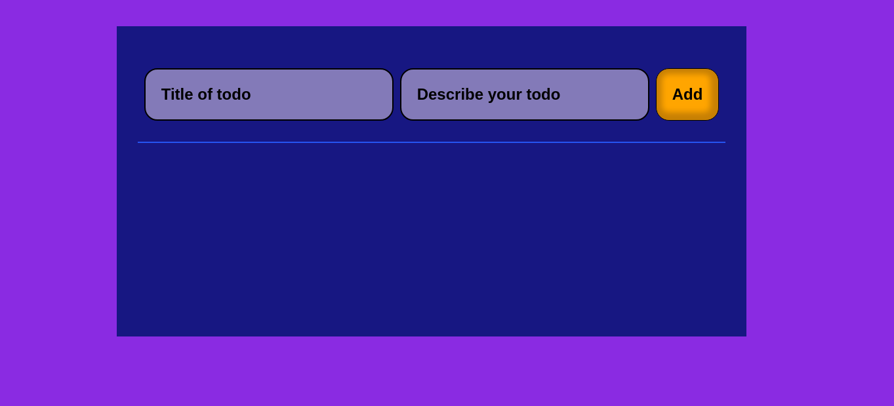
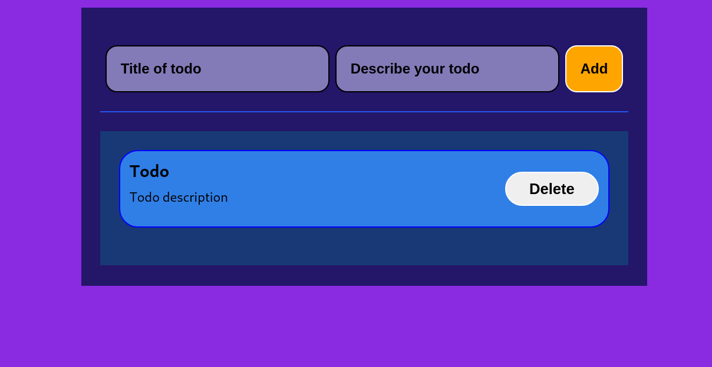
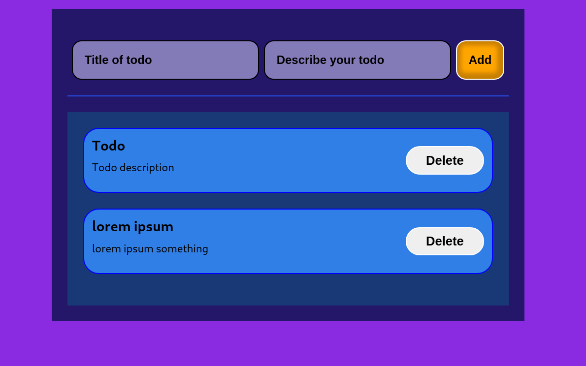
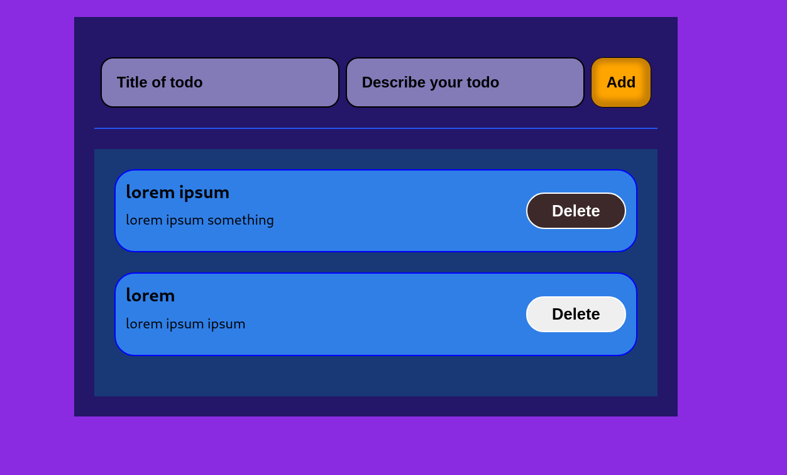
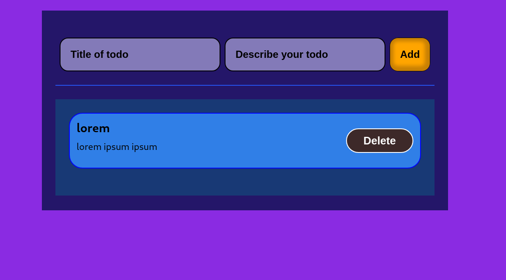

# TODO APP

This is a simple todo-app.

## _Result_

_When the todo list is empty_

_When an empty todo element is added_

_When an element is new element is added_

_Empty element is deleted and new element is added_

_Older todo item is deleted_

